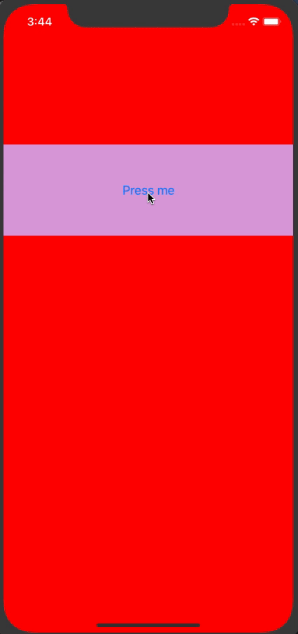
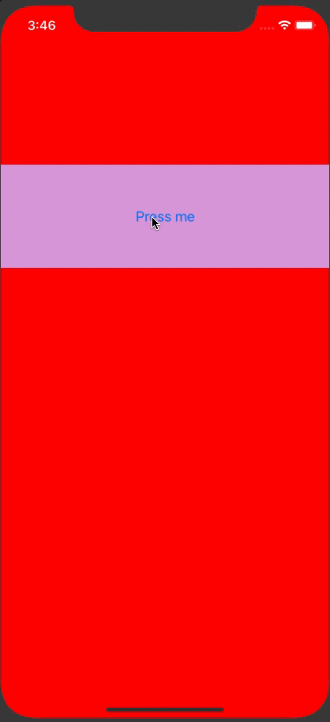
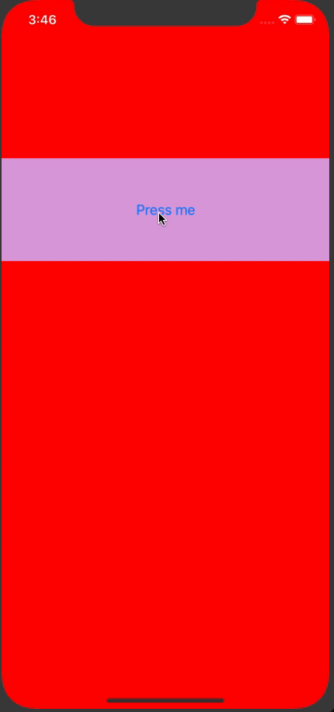

### Repro case for https://github.com/kmagiera/react-native-gesture-handler/pull/657

This repo has been created to illustrated problems with `RCTTouchHandler` discussed here: https://github.com/kmagiera/react-native-gesture-handler/pull/657

Below is how you should use it:

1. Clone the repo: `git clone git@github.com:kmagiera/CancelTouchesExample.git`

2. Enter project folder: `cd CancelTouchesExample`

3. Install yarn dependencies: `yarn`

4. Install pods: `cd ios; pod install`

^ Note that I added gesture-handler as development Pod so that we can make some changes in the codebase

5. Open workspace in XCode: `open ios/CancelTouchesExample.xcworkspace`

6. Run the app from XCode

7. When you run it you should see an app that renders a swipeable row built with gesture-handler (relying on UIPanGestureRecognizer) with a RN's Button component rendered inside. When you start press on the button it highlights but when you start pulling it cancels and pan gesture takes over:



8. The reason why highlight effect cancels is that we trigger `RCTTouchHandler cancel` when the pan gesture gets activated. To see what happens when we disable that let's go back to XCode and change the following file: `RNGestureHandlerManager.m` (I usually use shortcut `cmd+shift+o` in XCode and the start typing file name to locate it quickly). No comment out line 163 that calls `RCTTouchHandler cancel`, like that:

```
161:    UIView *parent = rootContentView.superview;
162:    if ([parent isKindOfClass:[RCTRootView class]]) {
163: //        [((RCTRootContentView*)rootContentView).touchHandler cancel];
164:    }
```

9. When you run the app this time you'll note that when we start panning the button does not cancel. Moreover when we release the finger the button `onPress` event fires and we get an alert that is hooked to the button's `onPress`:



10. Now we want to try making `RCTTouchHandler` failed using the means of UIGestureRecognizer API. What we will do is to change RN's `RCTTouchHandler` implementation such that it always responds `YES` from `canBePreventedByGestureRecognizer`. Go to XCode and open `RCTTouchHandler.m` (you can use `cmd+shift+o` shortcut to locate the file) and navigate to line 349, then replace it with `return YES;`. The method should look like:

```
345: - (BOOL)canBePreventedByGestureRecognizer:(UIGestureRecognizer *)preventingGestureRecognizer
346: {
347:   // We fail in favour of other external gesture recognizers.
348:   // iOS will ask `delegate`'s opinion about this gesture recognizer little bit later.
349:   return YES;
350: }
```

11. Once that's done the button in the app will still remain highlighted for the duration of pan gesture, however at least the `onPress` won't trigger. This happens because after the above change the `RCTTouchHandler` fails upon the PanGestureRecognizer activation. Despite of what's been discussed on the original PR https://github.com/kmagiera/react-native-gesture-handler/pull/657 the `RCTTouchHandler#touchesCancelled` does not get trigger upon a failure of the handler. As per apple's documentation that method only gets triggered when system event occur. Unless `touchesCancelled` is called however, the cancel event is never delivered to the JS and the button remains highlighted. But because the handler fails anyways we don't deliver `touchUp` which prevents `onPress` from firing.



